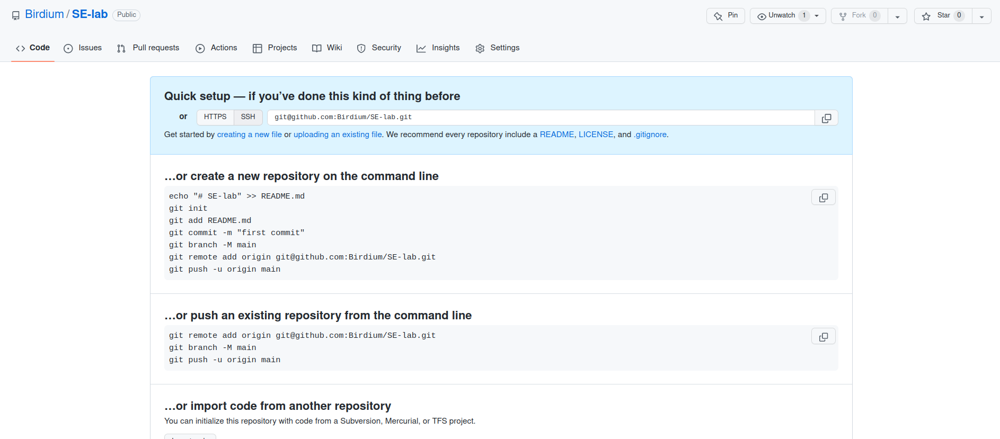

# 软件工程实验报告

#### 一、项目概述

本次实验目的是完成一个等价判断工具，输入为若干个文件夹，包括一些样例程序和一个文件格式，输出为若干个csv文件，记录等价程序对和不等价程序对。

实验使用的语言为Python，考虑到如下原因：

 	1. 程序等价判断程序行为比较贴近脚本，Python更为方便
 	2. 性能瓶颈主要来源于执行文件比对，python的性能缺陷会被降低
 	3. python具有基本的面向对象特性

#### 二、项目创建: 

1. 在github上创建空项目:

2. Clone到本地，现在SE-lab是一个包含了.git的文件夹（省去了在本地初始化的工作）
3. 设计基本的项目结构：我把程序分成了几个模块：输入模块、输出模块、测试生成模块、比较模块、数据表示模块。
4. 