# 软件工程lab6实验报告

#### 201840058 蒋潇鹏

#### 一、静态分析

1. 选取pylint, 下载安装pylint:
   

2. 使用说明：执行 `pylint [filename]` 进行检测。
   pylint 会显示出每个模块中的静态检查结果，其中，C代表Convention, E代表Error, R代表Refactor, W代表Warning，在这后面还有详细的信息提示
   最后pylint会为代码评分。

3. 在 `se-lab` 目录下执行 `pylint *.py` 进行检测。
   得到下图结果：
   

   可以看到代码是非常烂的。。甚至还有Error

4. 接下来对代码进行修复：

   1. 先从有错误的Module generator修起：
      
      我们看到这个小小的函数中竟然有三个错误！一个是参数过多，一个是 for in 语句的错误，还有一个是调用了str实例不存在的方法。但是奇怪的是，这个函数理应是会被频繁使用的，我去看了下lab4的两个测试样例，果然这两个样例没有生成任何string，因此我的程序完全可以运行测试样例而不报错。这验证了“未测试代码永远是错的”这一观点，由此可以说明测试是很重要的。
      修复后的代码：
      
      修复了三个错误，同时还修复了一个Warning: Unused variable 'i', 我使用了python的一个特性'_', 可以避免这一操作。
      修复后重新跑分结果：
      
      可以看到，此前generator的E, W提示消失了。
   2. 修复outputter: 
      
   3. 修复program:
      
   4. 修复main:
      
   5. 修复checker:
      
   6. 修复完大多数内容之后的结果：
      |
      消除了除了docstring以外的所有提示
      选择忽略docstring：执行 `pylint *.py --disable=missing-docstring`, 得到了Pylint的满分结果：
      

#### 二、单元测试

1. 测试目的：发现程序中的错误
   测试对象：等价判断工具中的所有程序
   测试环境：Manjaro Linux, python 3.10.8, PyCharm
   测试工具：python自带的unittest, Pycharm, coverage

2. 首先我们对input部分进行单元测试：
   测试目的：测试input的实现中是否有错误
   测试用例：如下文件：
   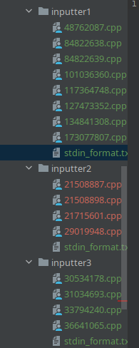
   测试使用的代码：包含了测试用例和预期输出

   ```python
   class MyTestCase(unittest.TestCase):
       def test_format(self):
           inputter_1 = Inputter(r"tests/inputter1")
           format_1 = inputter_1.get_format()
           self.assertTrue(format_1[0][0].get_type() == 'int')
           self.assertTrue(format_1[0][0].get_lower() == 1)
           self.assertTrue(format_1[0][0].get_upper() == 2)
           self.assertTrue(format_1[0][1].get_type() == 'string')
           self.assertTrue(format_1[0][1].get_lower() == 2)
           self.assertTrue(format_1[0][1].get_upper() == 3)
   
           inputter_2 = Inputter(r"tests/inputter2")
           format_2 = inputter_2.get_format()
           self.assertTrue(format_2[0][0].get_type() == 'int')
           self.assertTrue(format_2[0][0].get_lower() == 114)
           self.assertTrue(format_2[0][0].get_upper() == 514)
           self.assertTrue(format_2[0][1].get_type() == 'int')
           self.assertTrue(format_2[0][1].get_lower() == 191)
           self.assertTrue(format_2[0][1].get_upper() == 9810)
   
           inputter_3 = Inputter(r"tests/inputter3")
           format_3 = inputter_3.get_format()
           self.assertTrue(format_3[0][0].get_type() == 'int')
           self.assertTrue(format_3[0][0].get_lower() == 114)
           self.assertTrue(format_3[0][0].get_upper() == 514)
           self.assertTrue(format_3[0][1].get_type() == 'int')
           self.assertTrue(format_3[0][1].get_lower() == 191)
           self.assertTrue(format_3[0][1].get_upper() == 9810)
           self.assertTrue(format_3[1][0].get_type() == 'char')
           self.assertTrue(format_3[1][1].get_type() == 'char')
           self.assertTrue(format_3[1][2].get_type() == 'char')
           self.assertTrue(format_3[1][3].get_type() == 'char')
           self.assertTrue(format_3[1][4].get_type() == 'char')
           self.assertTrue(format_3[2][0].get_type() == 'string')
           self.assertTrue(format_3[2][0].get_lower() == 19)
           self.assertTrue(format_3[2][0].get_upper() == 19)
   
       def test_program(self):
           inputter_1 = Inputter(r"tests/inputter1")
           program_1 = inputter_1.get_programs()
           prog_dir_1 = [prog.get_dir() for prog in program_1]
           std_dir_1 = ['tests/inputter1/48762087.cpp', 'tests/inputter1/84822638.cpp', 'tests/inputter1/84822639.cpp',
                        'tests/inputter1/101036360.cpp', 'tests/inputter1/117364748.cpp', 'tests/inputter1/127473352.cpp',
                        'tests/inputter1/134841308.cpp', 'tests/inputter1/173077807.cpp']
           self.assertEqual(len(prog_dir_1), len(std_dir_1))
           self.assertTrue(len(set(prog_dir_1).difference(set(std_dir_1))) == 0)
   
           inputter_2 = Inputter(r"tests/inputter2")
           program_2 = inputter_2.get_programs()
           prog_dir_2 = [prog.get_dir() for prog in program_2]
           std_dir_2 = ['tests/inputter2/21508887.cpp', 'tests/inputter2/21508898.cpp', 'tests/inputter2/21715601.cpp',
                        'tests/inputter2/29019948.cpp']
           self.assertEqual(len(prog_dir_2), len(std_dir_2))
           self.assertTrue(len(set(prog_dir_2).difference(set(std_dir_2))) == 0)
   
           inputter_3 = Inputter(r"tests/inputter3")
           program_3 = inputter_3.get_programs()
           prog_dir_3 = [prog.get_dir() for prog in program_3]
           std_dir_3 = ['tests/inputter3/30534178.cpp', 'tests/inputter3/31034693.cpp', 'tests/inputter3/33794240.cpp',
                        'tests/inputter3/36641065.cpp']
           self.assertEqual(len(prog_dir_3), len(std_dir_3))
           self.assertTrue(len(set(prog_dir_3).difference(set(std_dir_3))) == 0)
   
   
   if __name__ == '__main__':
       unittest.main()
   
   ```

   测试方法：使用PyCharm IDE自带的测试功能:
   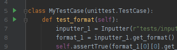
   运行右边的绿色小按钮来进行测试

   实际输出：出现了一些bug，对于 char 类型的输入，判断输出中对应行列的`Element.get_type() == "char"`, 但是实际上却输出了 `"c"`。检查的时候发现如下图所示的正则表达式中，上面两条捕获的类型是元组，但是char对应的捕获结果只是一个字符串。因此get_type获取`item[0]` 时，实际上获取了字符串的第一个元素 `"c"`。
   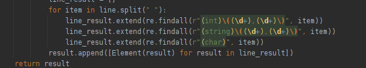
   修复完之后通过了所有测试：
   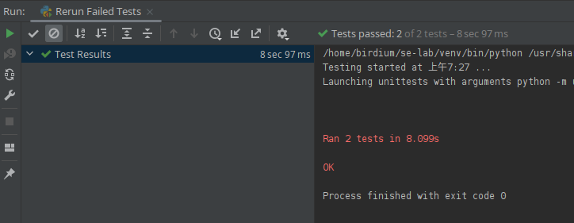
   单元测试覆盖率：覆盖了`input.py` 中的全部代码和 `element.py` 中全部代码。
   下面我们使用coverage工具来检查覆盖率：PyCharm Professional Edition中自带了这一功能：我们只需要点击绿色小三角，并选择`test ... with coverage`，就能获得Coverage报告：
   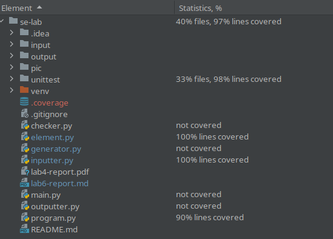
   我们可以看到，不仅覆盖了input 和 element，而且还覆盖了program中除了 `run()` 方法以外的方法。
   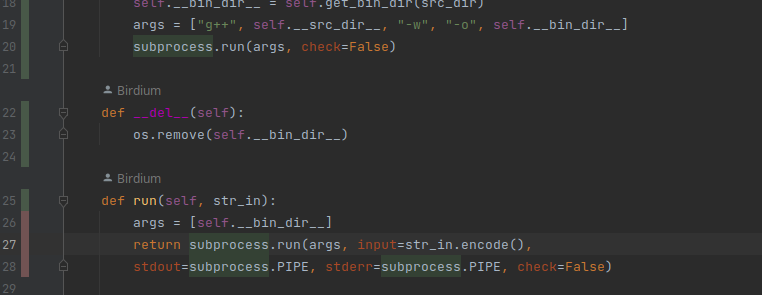
   左边的红色代表这一行没有被覆盖。

3. 接下来我们对 `generator.py` 进行测试：
   测试目的是为了测试generator生成器的实现正确性。
   测试用例，预期输出见下列代码

   ```python
   class MyTestCase(unittest.TestCase):
       def test_int(self):
           self.assertTrue(1 <= int(Generator.random_int(1, 4)) <= 4)
           self.assertTrue(11 <= int(Generator.random_int(11, 45)) <= 45)
           self.assertTrue(114 <= int(Generator.random_int(114, 514)) <= 514)
   
       def test_char(self):
           char_1 = Generator.random_char()
           self.assertTrue(ord('a') <= ord(char_1) <= ord('z') or ord('A') <= ord(char_1) <= ord('Z'))
   
       def test_str(self):
           str_1 = Generator.random_str(114, 514)
           self.assertIsInstance(str_1, str)
           for ch in str_1:
               self.assertTrue('a' <= ch <= 'z' or 'A' <= ch <= 'Z')
   
       def test_gen(self):
           test_format = [[('int', 1, 1), ('int', 4, 5), ('int', 1, 4)],
                          ['char', 'char', 'char'],
                          [('string', 19, 19), ('int', 8, 10)]]
           test_format = [[Element(elem) for elem in line] for line in test_format]
           test_generator = Generator(test_format)
           test_str = test_generator.gen_test()
           for lineno, line in enumerate(test_str.strip(' \n').split('\n')):
               for elemno, elem in enumerate(line.strip(' ').split(' ')):
                   if lineno == 0:
                       if elemno == 0:
                           self.assertEqual(int(elem), 1)
                       elif elemno == 1:
                           self.assertTrue(4 <= int(elem) <= 5)
                       elif elemno == 2:
                           self.assertTrue(1 <= int(elem) <= 4)
                       else:
                           self.assertTrue(False)
                   elif lineno == 1:
                       if 0 <= elemno <= 2:
                           self.assertTrue(ord('a') <= ord(elem) <= ord('z') or ord('A') <= ord(elem) <= ord('Z'))
                       else:
                           self.assertTrue(False)
                   elif lineno == 2:
                       if elemno == 0:
                           self.assertIsInstance(elem, str)
                           self.assertTrue(len(elem) == 19)
                           for ch in elem:
                               self.assertTrue('a' <= ch <= 'z' or 'A' <= ch <= 'Z')
                       elif elemno == 1:
                           self.assertTrue(8 <= int(elem) <= 10)
                       else:
                           self.assertTrue(False)
                   else:
                       self.assertTrue(False)
   
   
   if __name__ == '__main__':
       unittest.main()
   
   ```

   在测试的时候，我发现此前的 `random_int()` 函数的实现是错误的，在 `test_int()` 中的第一条语句报错，输出了 `5`。我发现源码中我实现如下：`return random.randint(lower, upper + 1)` ，去查阅手册发现 `random.randint(a, b)` 是在 [a, b] 区间中随机取值，因此之前的实现有误。

   修改后，通过了所有单元测试。

   测试覆盖率：`generator.py` 100%, `element.py` 92%

   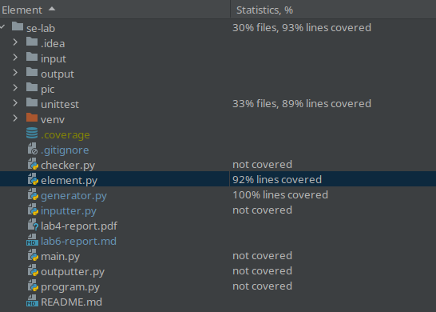

4. 接下来对 `checker.py` 进行测试
   测试目的：测试checker.py的实现正确。
   由于checker的特殊性：带有随机性，不能保证完全正确，我选取了输出固定的unittest进行测试：

   ```python
   class MyTestCase(unittest.TestCase):
       def test_checker(self):
           generator_1 = Generator([])
           progs_1 = [Program('tests/inputter1/48762087.cpp'),
                      Program('tests/inputter1/127473352.cpp'),
                      Program('tests/inputter1/134841308.cpp')]
           eq_1, neq_1 = Checker.check_list(progs_1, generator_1)
           for pair in eq_1:
               self.assertTrue(set(pair) == set(progs_1[1:3]))
           for pair in neq_1:
               self.assertTrue(set(pair) == set(progs_1[0:2]) or
                               set(pair) == set(progs_1[0:3:2]))
   ```

   测试结果是通过了所有测试样例，对checker.py有96%的覆盖率

5. 最后对 `outputter.py` 进行测试
   测试目的：测试output模块是否有正确输出。

   ```python
   class MyTestCase(unittest.TestCase):
       def test_output(self):
           program_1 = Program('tests/inputter1/134841308.cpp')
           program_2 = Program('tests/inputter1/48762087.cpp')
           program_3 = Program('tests/inputter1/84822638.cpp')
           eq_list1 = [[program_1, program_2]]
           neq_list1 = [[program_1, program_3], [program_2, program_3]]
           out_1 = Outputter(eq_list1, neq_list1, 'tests')
           if os.path.exists('tests/equal.csv'):
               os.remove('tests/equal.csv')
           if os.path.exists('tests/inequal.csv'):
               os.remove('tests/inequal.csv')
           out_1.write_csv()
           self.assertTrue(os.path.exists('tests/equal.csv'))
           self.assertTrue(os.path.exists('tests/inequal.csv'))
           if os.path.exists('tests/equal.csv'):
               os.remove('tests/equal.csv')
           if os.path.exists('tests/inequal.csv'):
               os.remove('tests/inequal.csv')
   ```

     成功通过了所有测试，Output模块覆盖率为91%.

6. 综上，我们的单元测试对每个模块完成，且文件覆盖率达到90%，语句覆盖率达到92%：
   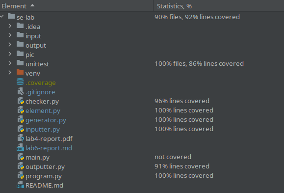

#### 三、集成测试

1. 测试目的：测试模块之间交互的正确性
   测试对象：等价判断工具
   测试环境、工具：同上
   测试方法：自底向上的测试方法

2. 首先将inputter和generator两个模块集成起来测试：
   测试目的：测试inputter模块和generator模块之间的交互

   ```python
       def test_input_gene(self):
           inputter_1 = Inputter(r"tests/inputter4")
           format_1 = inputter_1.get_format()
           generator_1 = Generator(format_1)
           for _ in range(10):
               test_str = generator_1.gen_test()
               print(test_str)
               for lineno, line in enumerate(test_str.strip(' \n').split('\n')):
                   for elemno, elem in enumerate(line.strip(' ').split(' ')):
                       if lineno == 0:
                           if elemno == 0:
                               self.assertEqual(int(elem), 1)
                           elif elemno == 1:
                               self.assertTrue(4 <= int(elem) <= 5)
                           elif elemno == 2:
                               self.assertTrue(1 <= int(elem) <= 4)
                           else:
                               self.assertTrue(False)
                       elif lineno == 1:
                           if 0 <= elemno <= 2:
                               self.assertTrue(ord('a') <= ord(elem) <= ord('z') or ord('A') <= ord(elem) <= ord('Z'))
                           else:
                               self.assertTrue(False)
                       elif lineno == 2:
                           if elemno == 0:
                               self.assertIsInstance(elem, str)
                               self.assertTrue(len(elem) == 19)
                               for ch in elem:
                                   self.assertTrue('a' <= ch <= 'z' or 'A' <= ch <= 'Z')
                           elif elemno == 1:
                               self.assertTrue(8 <= int(elem) <= 10)
                           else:
                               self.assertTrue(False)
                       else:
                           self.assertTrue(False)
   ```

   预期输出见代码，测试用例是一个只含有stdin_format.txt的文件夹，stdin_format.txt的内容同`inputter.py`单元测试中的内容
   测试结果是通过了所有样例，实际输出如下：
   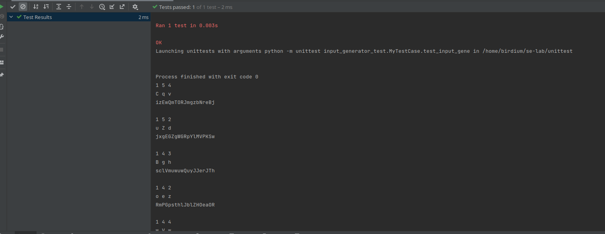

3. 然后我们将checker集成进来测试，测试目的是检查从inputter到generator到checker这一过程中有没有出现问题
   ```python
       def test_input_checker(self):
           inputter_1 = Inputter(r"tests/inputter3")
           format_1 = inputter_1.get_format()
           programs_1 = inputter_1.get_programs()
           generator_1 = Generator(format_1)
           eq_1, neq_1 = Checker.check_list(programs_1, generator_1)
           self.assertEqual(len(eq_1) + len(neq_1), len(programs_1) * (len(programs_1) - 1) / 2)
   ```

   代码中使用了一个文件夹作为测试用例，文件夹结构如下：
   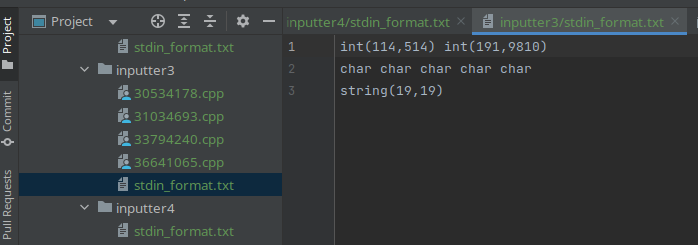
   
   预期输出是输出的等价程序对和不等价程序对加起来和为 $C_n^2$ 
   
   实际输出是程序给出了正确的结果。
   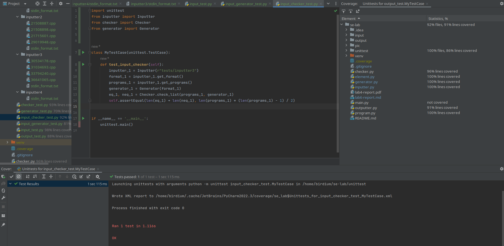

综上，我们完成了两个集成测试。
