# 软件工程lab6实验报告

#### 201840058 蒋潇鹏

#### 一、静态分析

1. 选取pylint, 下载安装pylint:
   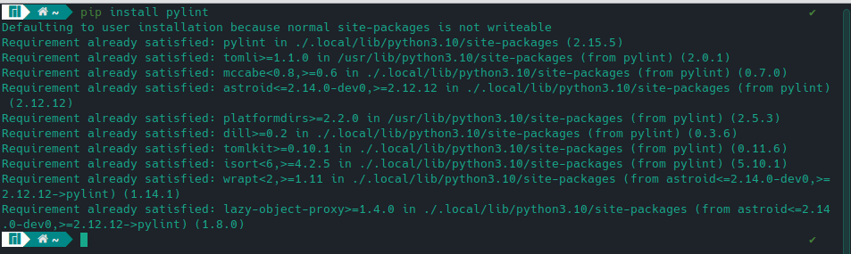

2. 使用说明：执行 `pylint [filename]` 进行检测。
   pylint 会显示出每个模块中的静态检查结果，其中，C代表Convention, E代表Error, R代表Refactor, W代表Warning，在这后面还有详细的信息提示
   最后pylint会为代码评分。

3. 在 `se-lab` 目录下执行 `pylint *.py` 进行检测。
   得到下图结果：
   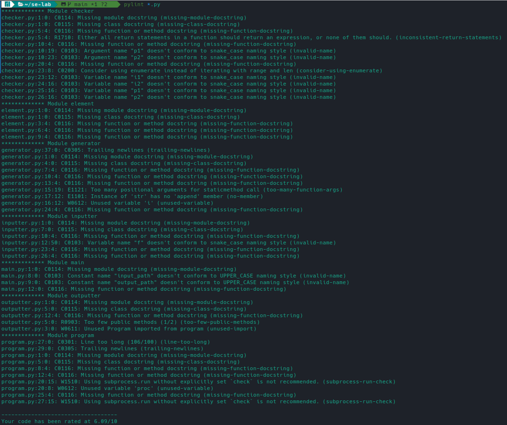

   可以看到代码是非常烂的。。甚至还有Error

4. 接下来对代码进行修复：

   1. 先从有错误的Module generator修起：
      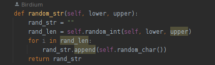
      我们看到这个小小的函数中竟然有三个错误！一个是参数过多，一个是 for in 语句的错误，还有一个是调用了str实例不存在的方法。但是奇怪的是，这个函数理应是会被频繁使用的，我去看了下lab4的两个测试样例，果然这两个样例没有生成任何string，因此我的程序完全可以运行测试样例而不报错。这验证了“未测试代码永远是错的”这一观点，由此可以说明测试是很重要的。
      修复后的代码：
      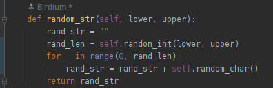
      修复了三个错误，同时还修复了一个Warning: Unused variable 'i', 我使用了python的一个特性'_', 可以避免这一操作。
      修复后重新跑分结果：
      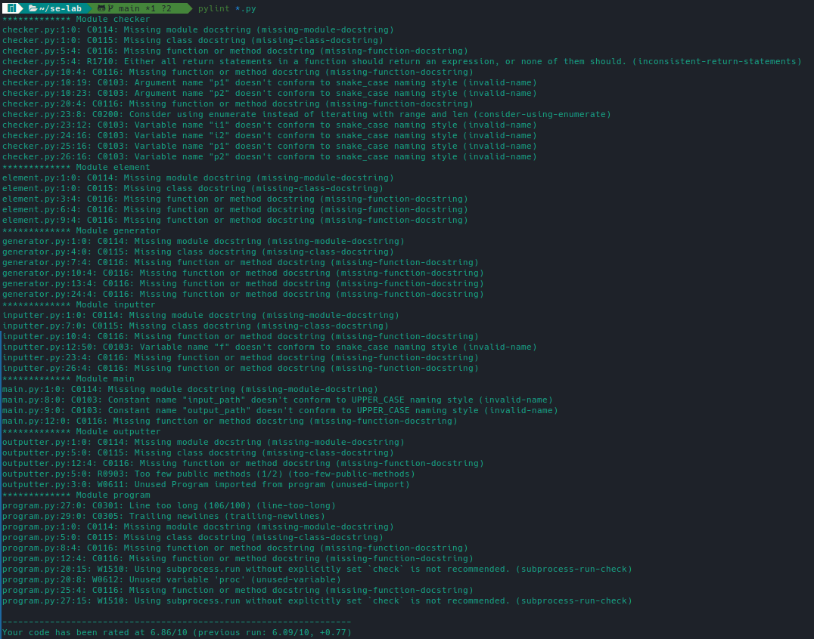
      可以看到，此前generator的E, W提示消失了。
   2. 修复outputter: 
      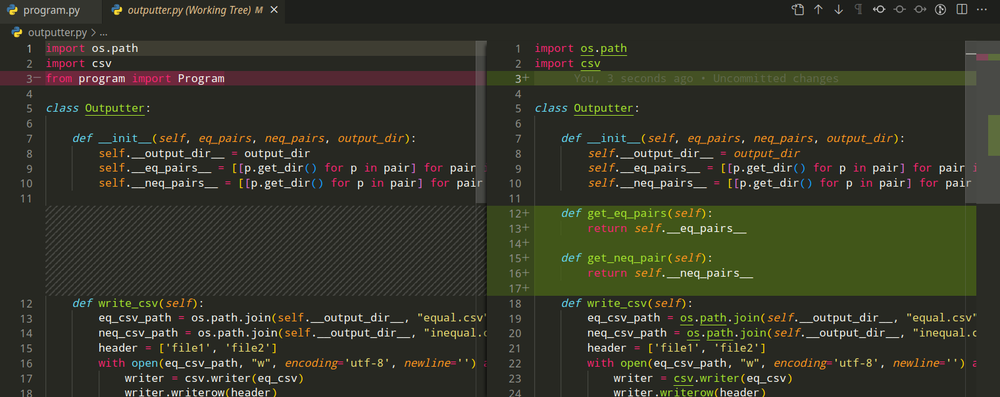
   3. 修复program:
      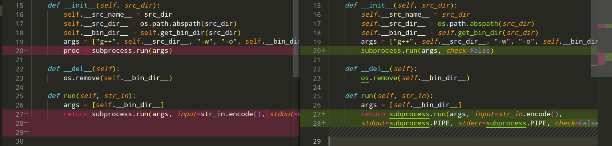
   4. 修复main:
      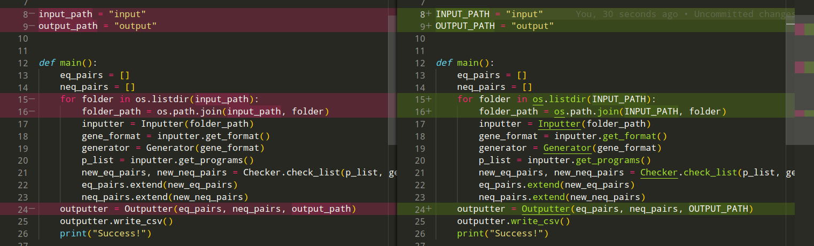
   5. 修复checker:
      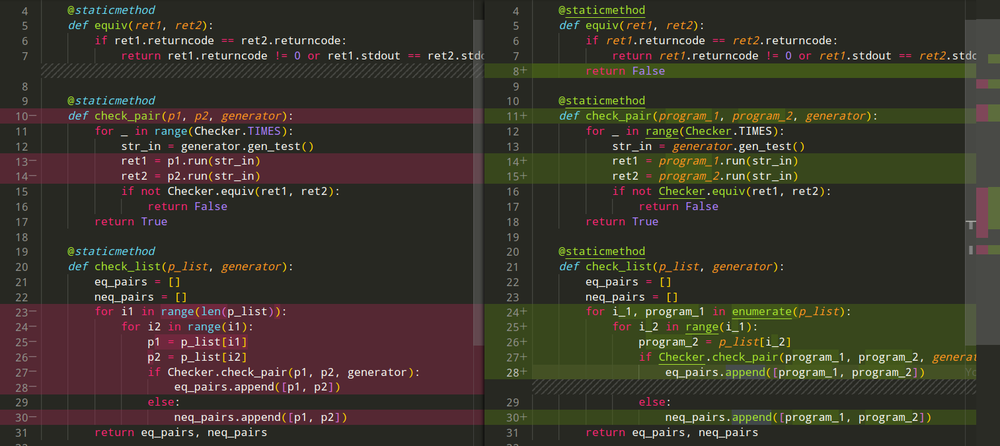
   6. 修复完大多数内容之后的结果：
      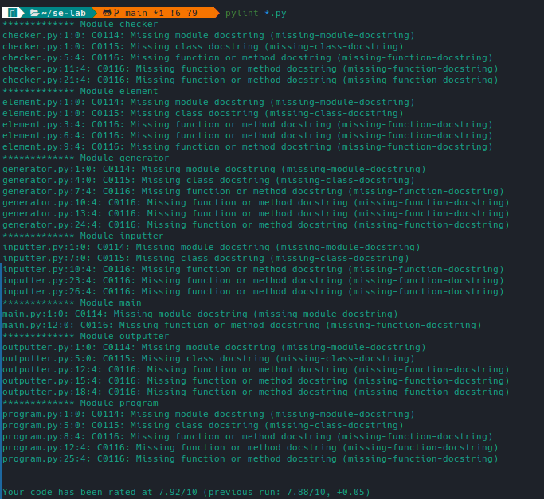|
      消除了除了docstring以外的所有提示
      但是docstring是个很麻烦的东西，因此我选择忽略docstring：执行 `pylint *.py --disable=missing-docstring`, 得到了Pylint的满分结果：
      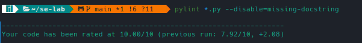

#### 二、单元测试

1. 测试目的 测试工具是python自带的unittest, 
